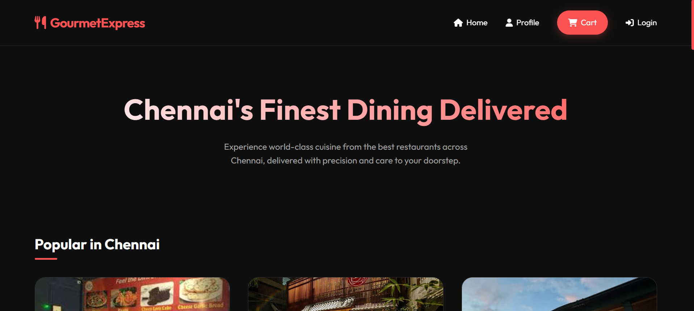
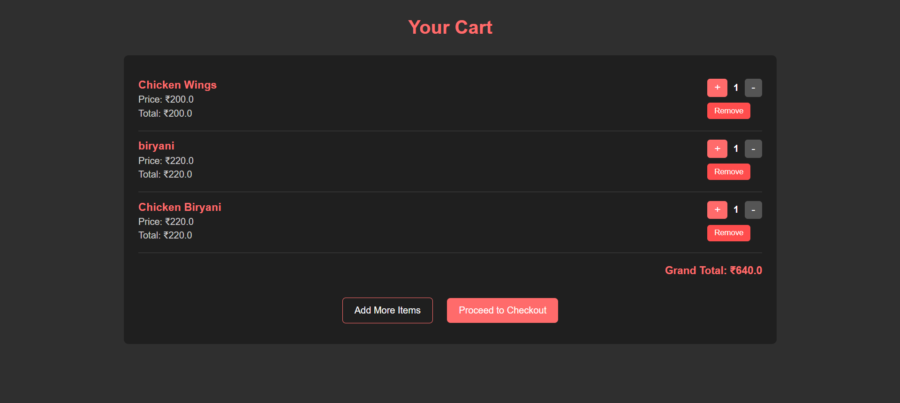
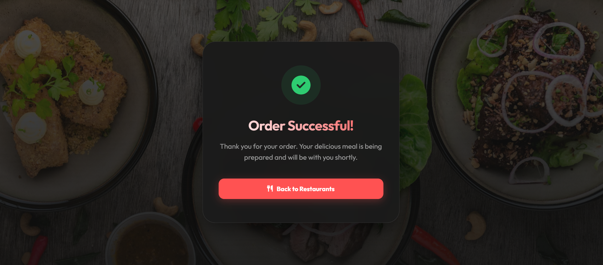

🍔 Food Delivery Application

A full-stack "Java-based Food Delivery Web Application" built using "JSP, Servlets, JDBC, and MySQL".  
This project simulates a real-world food ordering platform with user authentication, restaurant browsing, menu management, cart, checkout, and order placement.

---

🚀 Features

👤 User Module
- User registration and login
- Session-based authentication
- Secure checkout access

🏪 Restaurant Module
- View restaurants (location-based: Chennai)
- Restaurant details with cuisine, rating, and delivery time

📋 Menu Module
- Dynamic menu loading from database
- Multiple items per restaurant
- Images stored and loaded from server

🛒 Cart Module
- Add items to cart
- Increase / decrease quantity
- Remove items
- Cart restricted to one restaurant at a time

💳 Checkout & Orders
- Delivery address input
- Payment method selection
- Order creation and order items storage
- Order summary after checkout

---

🛠️ Tech Stack

| Layer          | Technology     |
|----------------|----------------|
|Frontend        | JSP, HTML, CSS |
|Backend         | Java Servlets  |
|Database        | MySQL          |
|Connectivity    | JDBC           |
|Server          | Apache Tomcat  |
|Version Control | Git & GitHub   |

---

🗂️ Project Structure

```
Food-Delivery-Application
├── src
│   └── main
│       ├── java
│       │   └── com
│       │       ├── model
│       │       ├── dao
│       │       ├── daoimplementation
│       │       └── servlets
│       └── webapp
│           ├── images
│           ├── jsp
│           └── html
├── README.md
```

---

⚙️ Setup Instructions

1. Clone the repository
   git clone https://github.com/THAMIZHMATHY/Food-Delivery-Application.git
  
   
2. Import project into Eclipse (Dynamic Web Project)  

3. Configure Apache Tomcat (10+)

4. Create MySQL database and tables
   (users, restaurant, menu, cart, orders, order_items)

5. Update DB credentials in DBConnection.java

6. Run the project on server

---

📌 Notes

This project is designed for learning and academic purposes

Authentication uses session management

Images are stored locally in the images folder

Only one restaurant’s items can be added to cart at a time

---


👩‍💻 Author

Thamizhmathy M
Java & Web Development Enthusiast

---

⭐ Future Enhancements

Password encryption

Admin dashboard

Order history page

Online payment gateway

Deployment on cloud server

---

## 📸 Screenshots

### 🏠 Home Page


### 📋 Menu Page


### 🛒 Cart Page


### 🔐 Login Page


### 📝 Register Page


### 💳 Checkout Page


### ✅ Order Placed


---

✨ Feel free to fork, star, or contribute!


